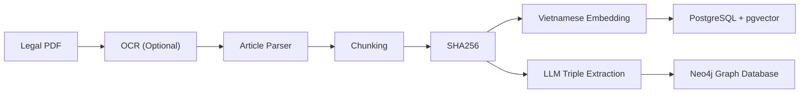

```mermaid
flowchart LR

PDF["Legal PDF"]

OCR["OCR (Optional)"]

Parser["Article Parser"]

Chunk["Chunking"]

Hash["SHA256"]

Embedding["Vietnamese Embedding"]

PG["PostgreSQL + pgvector"]

Triple["LLM Triple Extraction"]

Neo4j["Neo4j Graph Database"]

PDF --> OCR

OCR --> Parser

Parser --> Chunk

Chunk --> Hash

Hash --> Embedding
Hash --> Triple

Embedding --> PG

Triple --> Neo4j
```