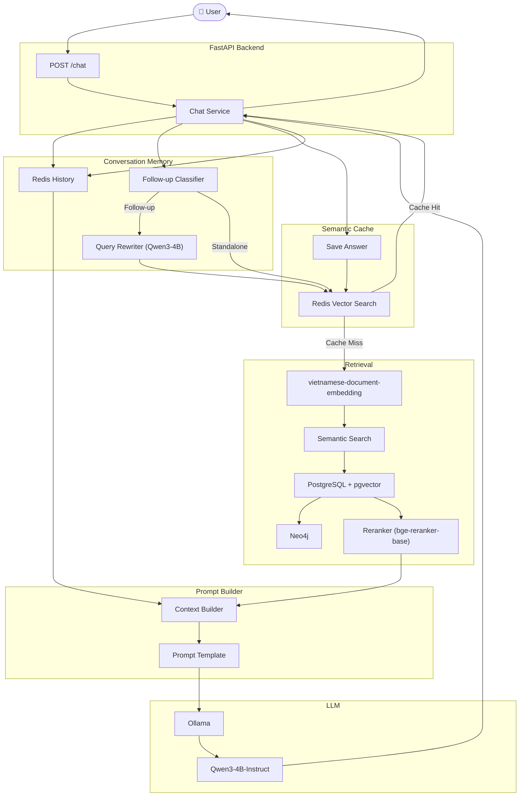

```mermaid
flowchart TB

    User([👤 User])

    subgraph API["FastAPI Backend"]
        Chat["POST /chat"]
        ChatService["Chat Service"]
    end

    subgraph Memory["Conversation Memory"]
        History["Redis History"]
        Followup["Follow-up Classifier"]
        Rewrite["Query Rewriter (Qwen3-4B)"]
    end

    subgraph Cache["Semantic Cache"]
        CacheSearch["Redis Vector Search"]
        CacheSave["Save Answer"]
    end

    subgraph Retrieval["Retrieval"]
        Embedding["vietnamese-document-embedding"]
        PG["PostgreSQL + pgvector"]
        Search["Semantic Search"]
        Graph["Neo4j"]
        Rerank["Reranker (bge-reranker-base)"]
    end

    subgraph Prompt["Prompt Builder"]
        Context["Context Builder"]
        Template["Prompt Template"]
    end

    subgraph LLM["LLM"]
        Ollama["Ollama"]
        Qwen["Qwen3-4B-Instruct"]
    end

    User --> Chat

    Chat --> ChatService

    ChatService --> History

    ChatService --> Followup

    Followup -->|Follow-up| Rewrite
    Followup -->|Standalone| CacheSearch

    Rewrite --> CacheSearch

    CacheSearch -->|Cache Hit| ChatService

    CacheSearch -->|Cache Miss| Embedding

    Embedding --> Search

    Search --> PG

    PG --> Graph
    PG --> Rerank

    Rerank --> Context

    History --> Context

    Context --> Template

    Template --> Ollama

    Ollama --> Qwen

    Qwen --> ChatService

    ChatService --> CacheSave

    CacheSave --> CacheSearch

    ChatService --> History

    ChatService --> User
```