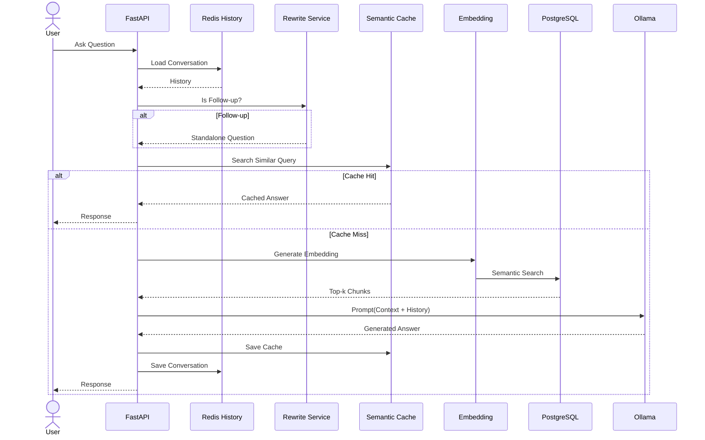

```mermaid
sequenceDiagram

actor User

participant API as FastAPI
participant History as Redis History
participant Rewrite as Rewrite Service
participant Cache as Semantic Cache
participant Embed as Embedding
participant PG as PostgreSQL
participant LLM as Ollama

User->>API: Ask Question

API->>History: Load Conversation

History-->>API: History

API->>Rewrite: Is Follow-up?

alt Follow-up
    Rewrite-->>API: Standalone Question
end

API->>Cache: Search Similar Query

alt Cache Hit
    Cache-->>API: Cached Answer
    API-->>User: Response

else Cache Miss

    API->>Embed: Generate Embedding

    Embed->>PG: Semantic Search

    PG-->>API: Top-k Chunks

    API->>LLM: Prompt(Context + History)

    LLM-->>API: Generated Answer

    API->>Cache: Save Cache

    API->>History: Save Conversation

    API-->>User: Response

end
```